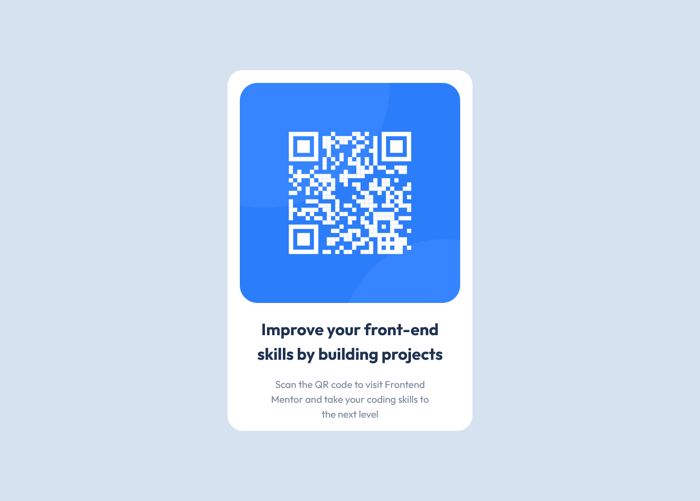

# QR-code-component

This is a solution to the [QR code component challenge on Frontend Mentor](https://www.frontendmentor.io/challenges/qr-code-component-iux_sIO_H). Frontend Mentor challenges help you improve your coding skills by building realistic projects. 

## Table of contents

- [Overview](#overview)
  - [Screenshot](#screenshot)
  - [Links](#links)
- [My process](#my-process)
  - [Built with](#built-with)
  - [What I learned](#what-i-learned)
- [Author](#author)
- [Acknowledgments](#acknowledgments)

## Overview
### Screenshot

### Links
- Solution URL: [https://github.com/MoyosorePraise/QR-code-component]
- Live Site URL: [https://moyosorepraise.github.io/QR-code-component/]

## My process
### Built with
- Semantic HTML5 markup
- CSS custom properties 

### What I learned
I was able to refractor my code to be DRY

## Author
- Frontend Mentor - [@MoyosorePraise](https://www.frontendmentor.io/profile/MoyosorePraise)
- Twitter - [@MoyosorePraise](https://www.twitter.com/MoyosorePraise)
